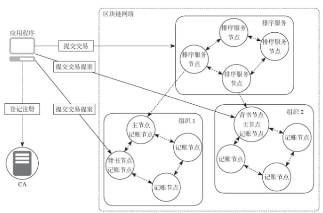

# hyperledger1.0分布式环境搭建

本篇主要介绍`hyperledger1.0`基本环境的搭建，看了一些现有的教程啥的，都是基于官方的一键脚本运行的，脚本里面基本都已经写好了如何配置参数，甚至自动组建区块链的环境都已经使用脚本做好的，本篇笔者通过阅读官方的脚本逐步搭建出一个多个节点参与非容器环境的超级账本环境。至于相关区块链的原理以及超级账本所使用的组件功能配置，在后面的学习笔记中会进行记录与解释。

## 一、基本环境简介



如上图所示，在实验环境中我们将实现如上图所示的区块链结构，因为是实验环境，资源有限，所以在排序服务我们先暂时使用单节点实现，先验证功能。如上图所示，图中的`组织1`和`组织2`就是组成联盟链中的成员。为了演示以及验证超级账本中的各个节点的功能，我们可以在每一个组织节点中放入两个节点。

## 二、基本环境准备

超级账本使用`Go`语言实现，`Go`语言会将最后的程序代码编译为二进制文件，所以在环境上我们需要在环境中安装`docker`(因为超级账本的链码背书环节需要用到docker环境)，详细的环境依赖可以参考[官网连接](http://hyperledger-fabric.readthedocs.io/en/v1.0.6/prereqs.html#), 因为本实验的环境是基于非容器环境的，意思是超级账本本身是不运行在容器中的(但是在执行链码时却是运行在docker环境中的，下面会有演示)，所以先要准备超级账本编译好的二进制包。官方给我们提供了一个下载脚本完成。

```bash
Shell> curl -sSL https://goo.gl/kFFqh5 | bash -s 1.0.6    #该版本是本文在编写时可以使用的版本
Shell> git clone https://github.com/hyperledger/fabric-samples.git # 下载演示工程目录，我们要搭建的环境其实就是自己阅读一遍这里的代码然后自己模拟一下这个搭建过程
```

如上命令执行完成后会在当前目录下自定新建一个`bin`目录里面包含了`超级账本`运行时所要依赖到的二进制文件。
```bash
[root@localhost fabric]# tree 
.
└── bin
    ├── configtxgen #生成组织配置文件以及初始创世纪块时需要用到
    ├── configtxlator
    ├── cryptogen # 生成超级账本中组织结构管理信任关系证书的工具，在初期实验是比较使用到，后期上线面对联盟链场景中拓展则需要专业的CA组件
    ├── get-byfn.sh
    ├── get-docker-images.sh
    ├── orderer   # 排序服务实现二进制文件
    └── peer      # peer节点实现二进制文件
```

## 三、分布式环境搭建步骤


### 3.1、


## 四、线上增加Peer或者Orderer节点


## 四、参考资料

